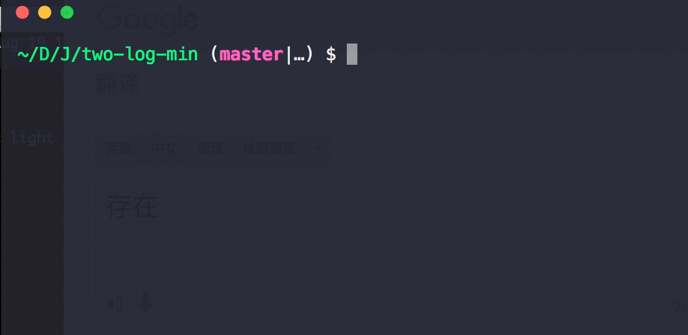
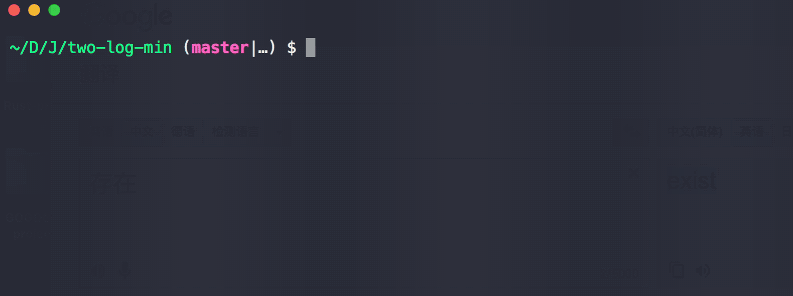

# two-log-min-cli [](https://travis-ci.org/chinanf-boy/two-log-min-cli)

> switch `ora` and `debug` , if `debug == true` log => `debug`, else log => `ora`

## cli DEMO

```
npm i -g two-log-min-cli
```

<p>


</p>

## CLI

> just Demo

```
npm install --global two-log-min
```

```
$ two-log-min --help

	Usage
	  $ two-log-min -D

	Options
	  -D  Debug [Default: false]

	Examples
	  $ two-log-min
	  ora show
	  $ two-log-min -D
	  all debug show
	  $ two-log-min -D cli
	  debug:cli show
```

## module

- [two-log-min](https://github.com/chinanf-boy/two-log-min) just need two log, `ora` / `debug`

## concat

- [two-log](https://github.com/chinanf-boy/two-log) just need two log, `ora` / `winston`

## License

MIT © [chinanf-boy](http://llever.com)
